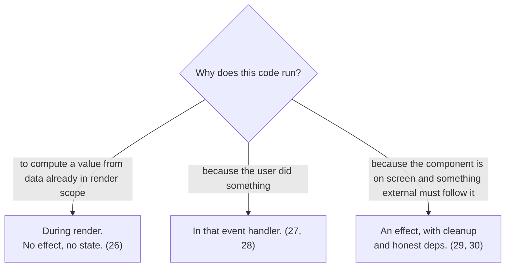

# Effects Are Synchronization

An effect has exactly one legitimate job: **keep something outside React in sync with the component while it is displayed** (a subscription, a browser API, a non-React widget, a network resource). Every effect finding in the [catalog's](../catalog.md) pillar 3 (categories 26 to 31) is code using an effect for one of the two jobs that belong elsewhere.

## The corollaries

- **Derived data is a render-time computation.** An effect that only calls `setState` from props or state adds a render cycle and a value that can drift (category 26 and [one-fact-one-home](one-fact-one-home.md)).
- **An event's consequences belong to the event.** Firing a POST because a flag flipped, or a parent callback from an effect watching internal state, delivers the news one render late and tangles causality (27, 28). The handler that caused the change makes the call, in the same event.
- **Synchronization implies desynchronization.** Whatever the effect sets up, the cleanup tears down: abort the fetch, remove the listener, close the socket (29). An effect without cleanup for an external resource is a leak or a race by construction.
- **The dependency array is the sync condition**, not a scheduling tool. It declares which values the synchronization reads ([render snapshots](render-snapshots.md)); editing it to control *when* the effect runs is the smell behind most `[]` bugs (30).
- **State reset is not synchronization.** Restarting state because an identity changed is `key={id}` at the call site, not an effect (31, and [controlled-uncontrolled](controlled-uncontrolled.md)).
