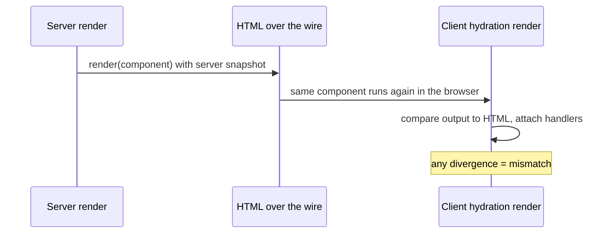

# Hydration and Render Purity

With SSR, a component renders **twice in two worlds**: once on the server to produce HTML, once in the browser where React walks that HTML and attaches behavior (hydration). Hydration assumes both renders produce the same output; every divergence is a hydration mismatch, surfacing as a console error, a content flash, misattached event handlers, or a full client re-render. This is why the [catalog's](../catalog.md) impure-render category (40) rates Rancid, and it is the runtime backdrop of the server-component boundary (category 17).

## What diverges, and the honest fix

| Divergence source | Why it differs | Fix |
| --- | --- | --- |
| `Math.random()`, `Date.now()`, `crypto.randomUUID()` in render | New value every call, so the two renders disagree | `useId` for element ids; randomness into a lazy initializer, effect, or handler |
| `window`, `localStorage`, `navigator.*` in render | Absent on the server (crash) or different (mismatch) | Read via an effect after mount, or `useSyncExternalStore` with a server snapshot |
| Locale or timezone formatting from the machine clock | Server and client machines disagree | Format from props both worlds share, or defer to an effect |
| "Render differently on the client" branches (`typeof window !== 'undefined'`) | Deliberately divergent first render | Render the server version first, switch after mount via effect-set state |

The general rule is the render-purity rule (category 40): a render is a pure function of props, state, and context. SSR is simply the environment that punishes every violation, because the impurity gets called twice with an equality check between the runs.
