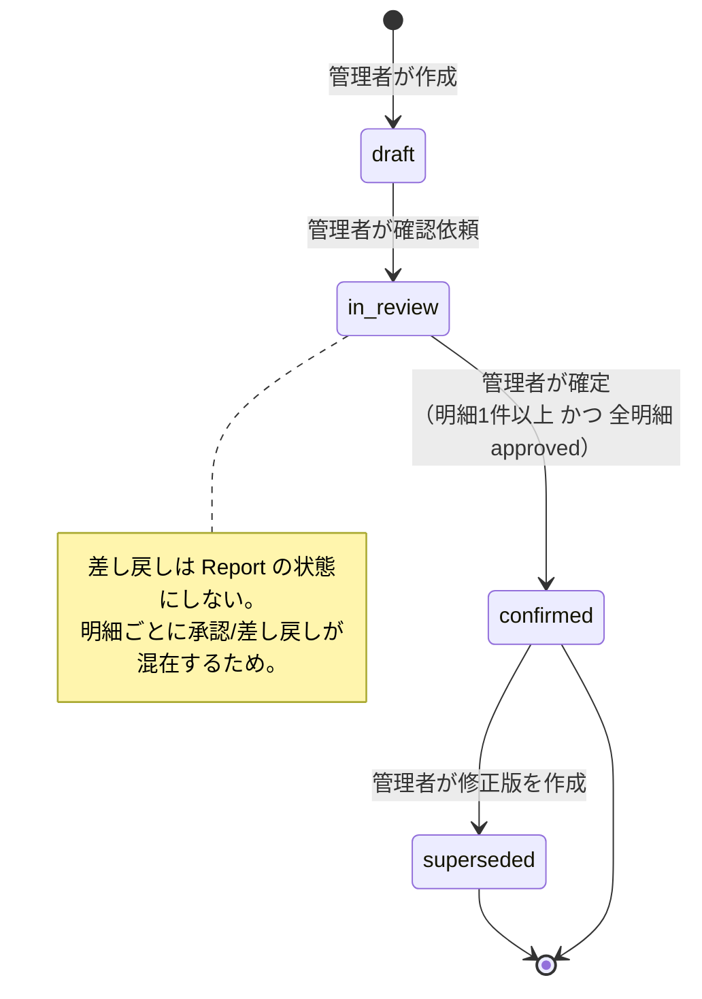
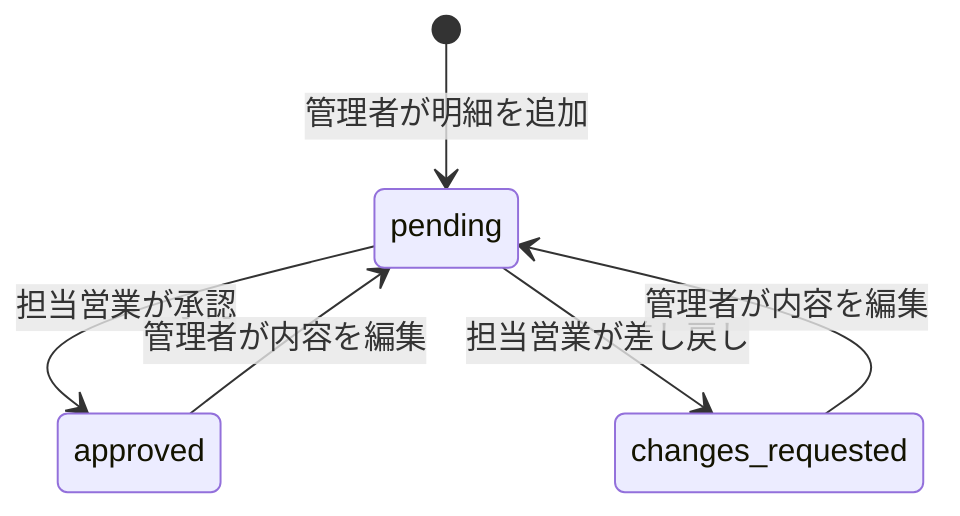
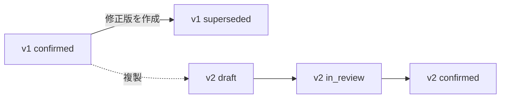
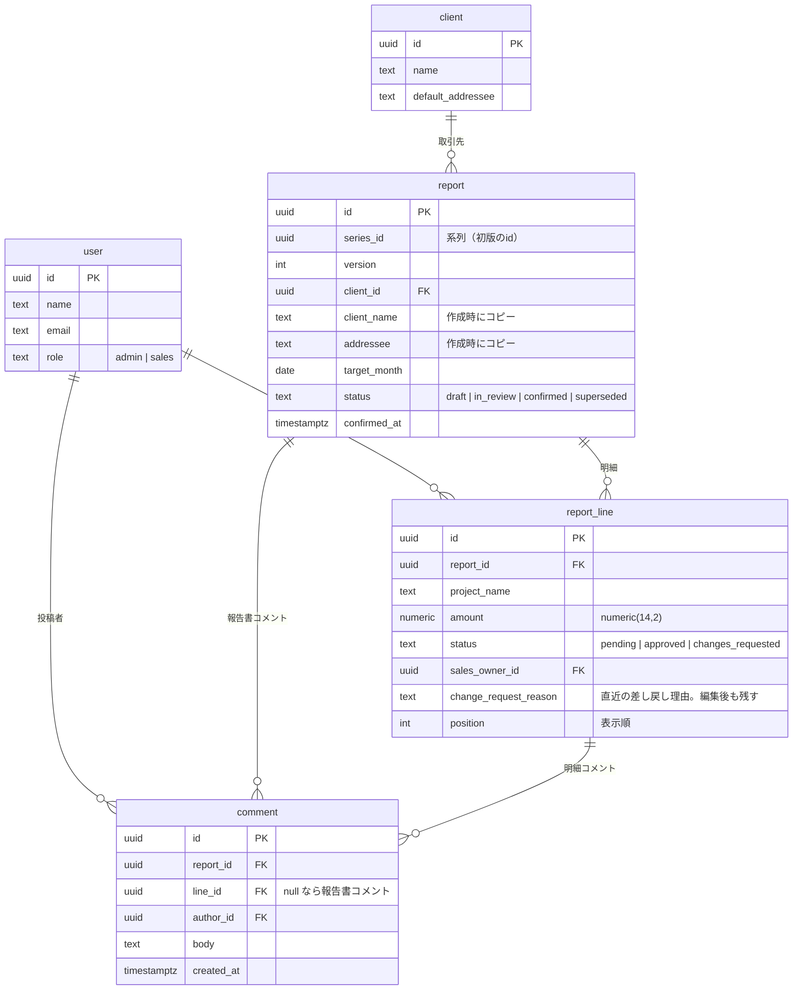

# 設計

用語は [CONTEXT.md](../CONTEXT.md) を正とする。個々の決定の経緯は [docs/adr/](./adr/) に分けて記録してある。このページはそれらを 1 枚に束ねたもの。

## 1. 状態

### Report の状態遷移

`in_review → draft`（取り下げ）は作らない。差し戻し対応の編集は `in_review` のまま行える。

### ReportLine の状態遷移

**承認は行ではなく、その時点の内容に紐づく**（[ADR-0007](./adr/0007-approval-is-bound-to-content.md)）。管理者が承認済みの明細を編集すると承認は失われ `pending` に戻る。これが無いと「営業が承認 → 管理者が金額を書き換える → 全明細承認済みなので確定できる」が成立し、提出書類として破綻する。

**`approved ↔ changes_requested` の直接遷移は無い。** 営業が確認できるのは `pending` の明細だけで、未確認へ戻せるのは管理者の編集だけ。営業が自分で確認状況を往復できると、内容が一度も変わっていないのに状態だけが動き、承認が「その時点の内容への意思表示」でなくなる。

明細の削除は `draft` 中のみ。`in_review` 以降で削除を許すと、差し戻された明細を消して指摘ごと無かったことにできてしまう。

### 修正版（Revision）

修正版は Report と ReportLine を丸ごと複製した**新しい Report**（[ADR-0009](./adr/0009-revision-is-a-copied-report.md)）。系列は `series_id`、順序は `version`。明細は版ごとに再編集・再承認され直すので、読み取り専用のスナップショットでは導線が書けない。

複製されるのは表紙（取引先名・宛先・対象月）と明細（案件名・金額・担当営業）まで。**確認状況は `pending` に戻り、差し戻し理由も引き継がない**。前の版の承認を引き継ぐと、直した内容を誰も見ないまま確定できてしまう（[ADR-0007](./adr/0007-approval-is-bound-to-content.md)）。コメントも複製しない（[ADR-0011](./adr/0011-comments-outlive-confirmation.md)）。

**書き込みの順序に業務ルールが埋まっている。** 1 つのトランザクションで、①新しい版を INSERT →②明細を複製→③元の版を `superseded` に UPDATE。トリガが「後継の版が存在すること」を `superseded` への更新条件にしているため、この順序でしか通らない。逆順を許すと「後継を作らずに確定済みを無効化する」経路が空く。

同じ系列で修正版が 2 つ並走しないことは 2 段で守る。アプリ側は事前に進行中の版を読んで `RevisionAlreadyInProgress` を返し、その判定と INSERT の間に割り込まれた場合は部分ユニークインデックスが止める。DB の拒否はそのまま 500 にせず、同じ `RevisionAlreadyInProgress` に写して 409 で返す。

**修正版は明細を 0 件にできない。** 旧版を `superseded` にした時点で「これはもう最新ではない」と宣言済みなので、その後継を空にすると、確認依頼にも進めず（0 件は拒否）旧版へも戻れない（`superseded` からは修正版を作れない）系列が残る。しかも空の版は営業の一覧に出ないので、誰にも見えないまま止まる。初版が 0 件でいられるのは、まだ誰にも何も約束していないため。

画面では詳細に**版の履歴**を出し、いま何版を見ているかと、他の版への導線を示す。旧版を残す設計は、辿れなければ意味がない。

## 2. 権限

ログインは seed 済みユーザーを選ぶだけのダミー方式。`user_id` を**署名付き httpOnly Cookie** に入れ、Elysia の macro が毎リクエストで検証する（[ADR-0015](./adr/0015-signed-cookie-dummy-login.md)）。ロールは `user.role`（`admin` / `sales`）。判定はこの macro 1 箇所を通り、そこから **Report 単位 → ReportLine 単位** の 2 段でかかる（[ADR-0010](./adr/0010-sales-owner-lives-on-the-line.md)）。

要件がダミーログインを許容しているための簡略化であり、本番運用の認証ではない。ただし Cookie の署名は外さない。生の `user_id` を入れると DevTools で書き換えるだけで他人になれ、以下の権限設計が丸ごと無意味になる。

| 操作           | 管理者      | 営業（担当明細）       | 営業（非担当） | 実行可能な状態                          |
| -------------- | ----------- | ---------------------- | -------------- | --------------------------------------- |
| Report の作成  | ✅          | ❌                     | ❌             | —                                       |
| 表紙の編集     | —（未実装） | ❌                     | ❌             | —                                       |
| 明細の追加     | ✅          | ❌                     | ❌             | `draft` / `in_review`                   |
| 明細の編集     | ✅          | ❌                     | ❌             | `draft` / `in_review`                   |
| 明細の削除     | ✅          | ❌                     | ❌             | `draft` のみ（修正版は 0 件にできない） |
| 確認依頼       | ✅          | ❌                     | ❌             | `draft`                                 |
| 明細の承認     | ❌          | ✅                     | ❌             | `in_review`                             |
| 明細の差し戻し | ❌          | ✅                     | ❌             | `in_review`                             |
| コメント投稿   | ✅          | ✅                     | ❌             | 全状態（確定後も可）                    |
| 確定           | ✅          | ❌                     | ❌             | `in_review`                             |
| 修正版の作成   | ✅          | ❌                     | ❌             | `confirmed`                             |
| 閲覧           | 全 Report   | 関係する系列の全ての版 | ❌             | 全状態                                  |

**唯一の無認証エンドポイントは `GET /api/auth/users`**（ログイン画面の選択肢）。ログイン前に呼ぶ必要があるので、ダミーログインという方式の必然。名前とロールが誰にでも見えることを承知のうえで許容している。本番相当の認証へ差し替えるときに真っ先に消える経路（[ADR-0015](./adr/0015-signed-cookie-dummy-login.md)）。

**担当営業に指定できるのは営業ロールのユーザーだけ**。サーバーが検証する。営業以外を担当にした明細は誰にも承認されず、その報告書は永久に確定できなくなるため。画面の選択肢も営業に絞っているが、それは表示の都合であって防御ではない。

表紙（取引先・対象月・宛先）は作成時に決まり、後から変える手段を実装していない。取引先を変えるのは別の報告書を作るのと同じであり、対象月と宛先の訂正だけを許す UI は版管理より優先度が低いと判断した。直したい場合は下書きのうちに作り直す。

「関係する系列」= 自分が担当する ReportLine を 1 件以上含む版が、その系列に 1 つ以上ある。営業は Report を**全体として**閲覧できる（金額合計や他の明細が見えないと承認の意味が痩せるため）が、操作できるのは自分の担当明細だけ。

**閲覧だけ系列単位に広げている**（[ADR-0010](./adr/0010-sales-owner-lives-on-the-line.md)）。版ごとに判定すると、版の履歴に出ているリンクを踏んだ先で拒否される。修正版で担当が付け替えられた場合に起こり、営業は「担当を外れた」のか「まだ明細が入っていない」のかを確かめられなくなる。一覧は「いま自分が確認すべきもの」を出す場所なので、担当明細を含む版だけに絞ったまま。

### 確定の条件

明細が **1 件以上** あり、かつ **全明細が `approved`** のときのみ（[ADR-0012](./adr/0012-confirm-preconditions.md)）。

「全明細が承認済み」は明細 0 件のとき自動的に真になるので、件数条件を明示的に足している。これが無いと空の報告書が不可逆に確定する。

満たさない場合はサーバー側で `LinesNotFullyApproved` を返す。UI は確定ボタンを**非活性にしたうえで、未承認 N 件・差し戻し N 件を出す**。個々の差し戻し理由は明細表のその行に出す。理由は「どの明細を直すか」と対になった情報なので、行から引き剥がすと突き合わせが読み手の仕事になる。ボタンを消さないのは、ユーザーが知りたいのが「押せるか」ではなく「あと何をすれば前に進めるか」だから。UI の非活性化は表示の都合であって防御ではなく、サーバー側の拒否が唯一の保証。

### 確定後の不変性

`confirmed` / `superseded` な Report とその ReportLine は変更できない。ドメイン層のガードに加え、**PostgreSQL のトリガでも拒否する**（[ADR-0008](./adr/0008-immutability-enforced-in-two-layers.md)）。Report 側は UPDATE・DELETE を、ReportLine 側は INSERT も含めて拒否する（明細を後から足す経路も塞ぐため）。

Report で唯一許す更新は `confirmed → superseded` の status 変更のみ。**しかも同じ系列により新しい版が既に存在するときに限る**。後継を作らずに確定済みを無効化されないようにするため。

コメントはこの制約の外側にある（[ADR-0011](./adr/0011-comments-outlive-confirmation.md)）。不変性は「取引先に提出される中身」に掛かる制約であり、やりとりの記録はその中身ではない。確定後に誤りを見つけた人が経緯を残せないのは運用として成立しない。

## 3. データモデル

実テーブル名は複数形（`users` / `clients` / `reports` / `report_lines` / `comments`）。上図は読みやすさのため単数で書いている。列と型の正は [`src/db/schema.ts`](../src/db/schema.ts)。`created_at` / `updated_at` は全テーブルにあるが、図では省略している。

`user` は自前のテーブル。認証基盤を入れないので session / account といった付随テーブルは無い（[ADR-0015](./adr/0015-signed-cookie-dummy-login.md)）。

### 設計上の要点

- **金額合計は持たない。** 明細から都度算出する。確定後は明細が不変なので算出結果も不変であり、保存すると「明細を編集したのに合計の更新を忘れる」経路が増えるだけ。
- **取引先名と宛先は報告書へコピーする**（[ADR-0014](./adr/0014-client-master-with-copied-cover-fields.md)）。マスタを FK で引くだけにすると、取引先の社名変更で確定済み報告書の表示が書き換わる。不変性の一番わかりにくい違反経路。
- **担当営業は `report_line` だけが持つ。** `report` 側に非正規化しない。同じ事実を 2 箇所に持つとずれる。

### DB 制約

業務ルールを担っているもの:

| 制約                                                                          | 目的                                           |
| ----------------------------------------------------------------------------- | ---------------------------------------------- |
| `unique(series_id, version)`                                                  | 版番号の重複を防ぐ                             |
| `series_id` に対する部分ユニーク（`status in ('draft','in_review')`）         | 同じ系列で修正版が 2 つ並走する事故を止める    |
| `reports` のトリガ（`confirmed` / `superseded` 行の UPDATE・DELETE を拒否）   | 確定後の不変性をアプリ層のバグから守る         |
| `report_lines` のトリガ（凍結済みの親に対する INSERT・UPDATE・DELETE を拒否） | 確定後に明細を足す／抜く／付け替える経路も塞ぐ |
| `reports_confirmed_at_matches_status`（CHECK）                                | 確定日時と状態が食い違う行を作らせない         |
| `report_lines_reason_required_when_changes_requested`（CHECK）                | 理由の無い差し戻しを作らせない                 |
| `report_lines_amount_non_negative`（CHECK）                                   | 負の金額を弾く                                 |

**`reports` のトリガが唯一許す更新は `confirmed → superseded` の status（と `updated_at`）だけ**で、しかも**同じ系列により新しい版が既に存在するとき**に限る。後継を作らずに確定済みを無効化する経路を残さないため。

`report_lines` 側は INSERT も拒否する。UPDATE・DELETE だけを塞ぐと、確定後に明細を足せてしまう。付け替え（`report_id` の書き換え）は移動元・移動先の両方を見る。片方だけだと、確定済みから明細を下書きへ移して中身を抜ける。

このほか整合性のための `users.email` の一意制約と、`reports`（series / client）・`report_lines`（report / owner）・`comments`（report / line）の索引がある。

Drizzle のスキーマ定義だけを読むとトリガの存在が見えないので、スキーマ側にコメントを残す。実体は [`drizzle/0001_immutable_confirmed_reports.sql`](../drizzle/0001_immutable_confirmed_reports.sql) と [`drizzle/0002_close_immutability_bypasses.sql`](../drizzle/0002_close_immutability_bypasses.sql)。

## 4. seed

起動直後に全状態を触れるよう、5 系列を投入する。

| #   | 状態                              | 意図                                               |
| --- | --------------------------------- | -------------------------------------------------- |
| 1   | `draft`                           | 作りかけ。明細の追加・編集・削除を試せる           |
| 2   | `in_review` / 全明細 `pending`    | 営業でログインして承認を試せる                     |
| 3   | `in_review` / 差し戻し 1 件を含む | 確定ボタンが非活性で理由が出ている状態を即見られる |
| 4   | `confirmed`                       | 編集不可であることを確認できる                     |
| 5   | `superseded` + v2 が `draft`      | 修正版フローの結果を確認できる                     |

ユーザーは管理者 1・営業 2。`user` テーブルへ直接 insert する。パスワードは無い（[ADR-0015](./adr/0015-signed-cookie-dummy-login.md)）。
